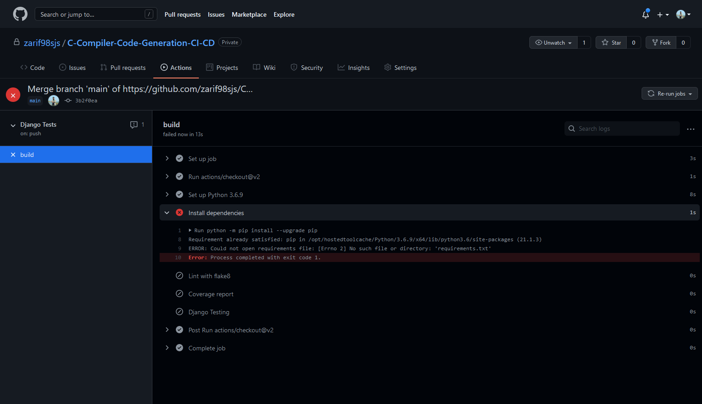
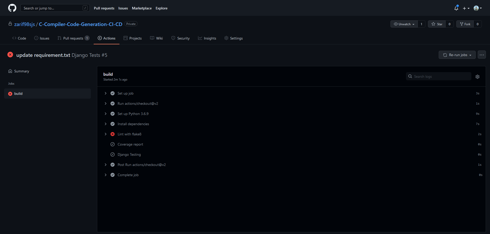
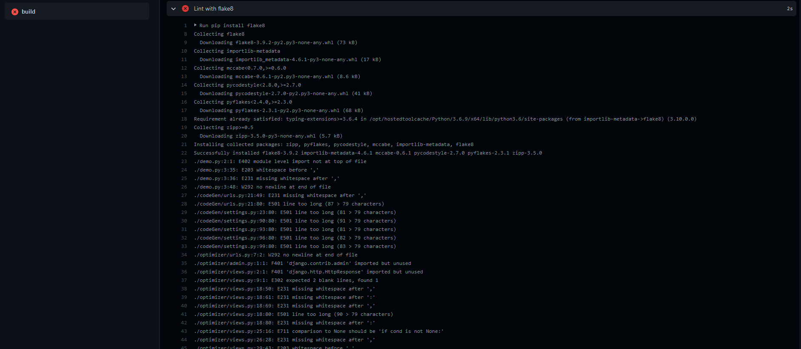
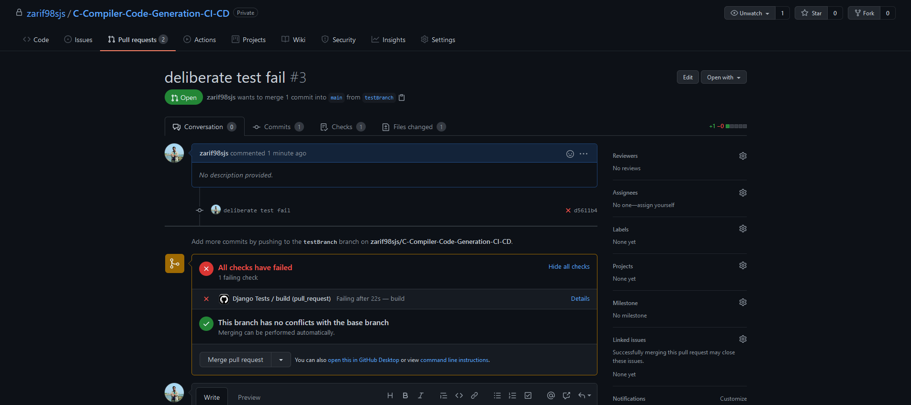
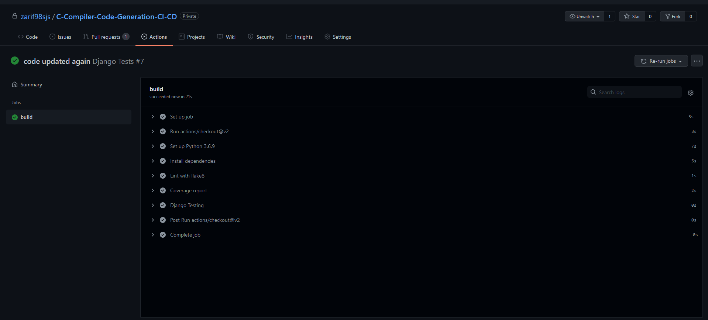

# C-Compiler-Code-Generation-CI-CD
 
# `Continuous Integration (CI)`

Continuous integration (CI) is the practice of automating the integration of code changes from multiple contributors into a single software project. It’s a primary DevOps best practice, allowing developers to frequently merge code changes into a central repository where builds and tests then run. Automated tools are used to assert the new code’s correctness before integration.

Here we demonstrate a CI pipeline using GitHub Actions. For the purpose of this demonstration, we created a 8086 Assembly Code Generator.

Whenever any contributor is making a push to the `main` branch or making a pull request to the `main` branch, an automated process is initiated. There we need to check if the pushed code breaks the codebase or not. This part is automated through the CI process.

We can initiate the CI process by creating the following yaml in `.github\workflows` directory

```yaml
name: Django Tests

on:
  push:
    branches:
      - main
  
  pull_request:
    branches:
      - main

jobs:
  build:

    runs-on: ubuntu-latest

    steps:
    - uses: actions/checkout@v2
    - name: Set up Python 3.6.9
      uses: actions/setup-python@v2
      with:
        python-version: 3.6.9
    - name: Install dependencies
      run: |
        python -m pip install --upgrade pip
        pip install -r requirements.txt
    - name: Lint with flake8
      run: |
        pip install flake8
        flake8
    - name: Coverage report
      run: |
        pip install coverage
        coverage run manage.py test
        coverage report
    - name: Django Testing
      run: |
        python3 manage.py test
```

## Continuous Integration : `Fail`


- Dependency fail
  
    

- Code quality fail

    

    

- Django test fail

    

## Continuous Integration : `Pass`

All passed


