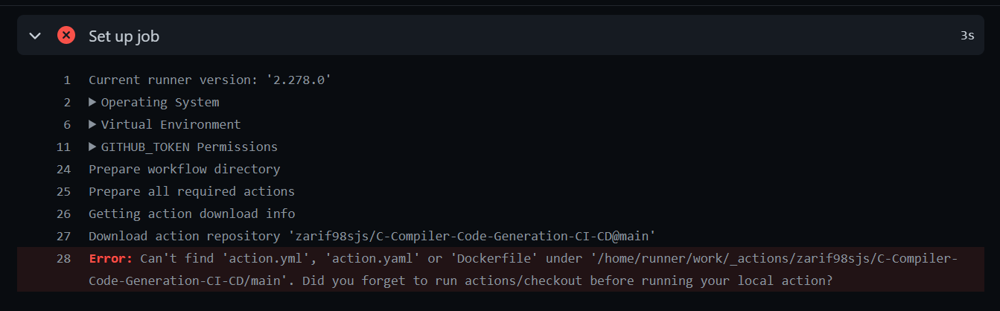
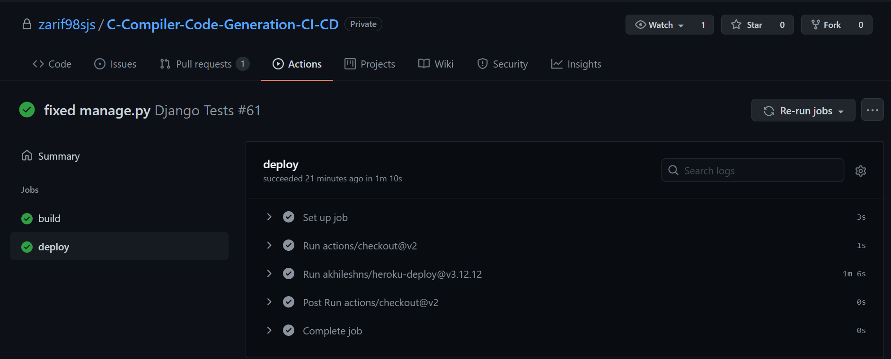

# C-Compiler-Code-Generation-CI-CD
 
# `Continuous Integration (CI)`

Continuous integration (CI) is the practice of automating the integration of code changes from multiple contributors into a single software project. It’s a primary DevOps best practice, allowing developers to frequently merge code changes into a central repository where builds and tests then run. Automated tools are used to assert the new code’s correctness before integration.

Here we demonstrate a CI pipeline using GitHub Actions. For the purpose of this demonstration, we created a 8086 Assembly Code Generator.

Whenever any contributor is making a push to the `main` branch or making a pull request to the `main` branch, an automated process is initiated. There we need to check if the pushed code breaks the codebase or not. This part is automated through the CI process.

We can initiate the CI process by creating the following yaml in `.github\workflows` directory

```yaml
name: Django Tests

on:
  push:
    branches:
      - main
  
  pull_request:
    branches:
      - main

jobs:
  build:

    runs-on: ubuntu-latest

    steps:
    - uses: actions/checkout@v2
    - name: Set up Python 3.6.9
      uses: actions/setup-python@v2
      with:
        python-version: 3.6.9
    - name: Install dependencies
      run: |
        python -m pip install --upgrade pip
        pip install -r requirements.txt
    - name: Lint with flake8
      run: |
        pip install flake8
        flake8
    - name: Coverage report
      run: |
        pip install coverage
        coverage run manage.py test
        coverage report
    - name: Django Testing
      run: |
        python3 manage.py test
```

## Continuous Integration : `Fail`


- Dependency fail
  
    

- Code quality fail

    

    

- Django test fail

    

## Continuous Integration : `Pass`

All passed


 


# `Continuous Deployment (CD)`
Continuous Deployment (CD) is a software release process that uses automated testing to validate if changes to a codebase are correct and stable for immediate autonomous deployment to a production environment. CD workflows such as deploying a website to Heroku can also be automated with Github Actions.

## Tasks
1. Deploying our project as a website in the Heroku platform
2. Automating the deploying process using GitHub Actions 


## Detailed Steps

### `Deploying To Heroku`
For deploying our website to Heroku, we performed the following steps :
- Ran the following commands in our project terminal :
    - pip install gunicorn
    - pip install whitenoise
- Created two files in out project folder : 'Procfile' and 'runtime.txt' and added the following content :
    - Procfile : web: gunicorn codeGen.wsgi
    - runtime.txt : Python 3.9.6
- Created static > main.css
- Configured our settings.py file
    - added 'whitenoise.middleware.WhiteNoiseMiddleware' in MIDDLEWARE

_.codeGen\settings.py
```
STATIC_ROOT = os.path.join(BASE_DIR, 'staticfiles')
STATIC_URL = '/static/'
STATICFILES_DIRS = [os.path.join(BASE_DIR, "static")]

STATICFILES_STORAGE = 'whitenoise.storage.CompressedManifestStaticFilesStorage'
```

- Ran the following command :
    - pip freeze > requirements.txt
- Created a Heroku Account
- Created a new app
- Choose GitHub as 'Deployment Method'
- Connected our Github repository to our Heroku App
- Chose 'Manual Deploy' option
- In out settings.py file configured the ALLOWED_HOSTS

_.codeGen\settings.py
```
ALLOWED_HOSTS = ['127.0.0.1', 'compiler-ci-cd.herokuapp.com']
```


### `Configuring Continuous Deployment Using Actions`
For using actions to deploy, we edited our **testing.yml** file inside .github/workflows with the following content :

_.github/workflows/testing.yml_
```yaml
deploy:
    runs-on: ubuntu-latest
    steps:
      - uses: actions/checkout@v2
      - uses: akhileshns/heroku-deploy@v3.12.12
        with:
          heroku_api_key: ${{secrets.HEROKU_API_KEY}}
          heroku_app_name: "compiler-ci-cd"
          heroku_email: my_email_address
```
- Heroku account > Account Settings >  API Key > Copied the key
- GitHub Repo > Settings > Secrets > "New Secret" > name : HEROKU_API_KEY > value : pasted copied value from previous step

[This repository](https://github.com/AkhileshNS/heroku-deploy/) lets us deploy our website to heroku platform.

After completion of all the above steps, we can now push our project to GitHub and it will be automatically deployed to Heroku henceforth.


## Demonstration

### Continuous Deployment : `Fail`




### Continuous Deployment : `Pass`



